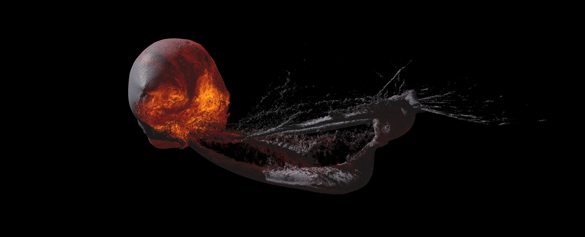

# PlanetaryImpacts



PlanetaryImpacts simulates planetary-scale collisions with smoothed particle hydrodynamics on the GPU. It uses Vulkan compute for simulation stepping, HDF5 datasets for input/output, aligned `float3` storage for GPU buffers, and EOS table preprocessing for material response. The interactive viewer and headless runner share the same GPU simulation path.

## Quick Start

These commands clone the project, install the core build dependencies, compile the Vulkan shaders, and start a long headless GPU run.

### Ubuntu / Debian

```sh
sudo apt update
sudo apt install -y \
  git build-essential cmake \
  libvulkan-dev vulkan-tools glslc \
  libhdf5-dev libglfw3-dev

git clone https://github.com/Charlie-Close/PlanetaryImpacts.git
cd PlanetaryImpacts

cmake -S . -B build
cmake --build build -j 8

./build/sph_vulkan --headless --steps 10000000
```

### Fedora

```sh
sudo dnf groupinstall -y "Development Tools"
sudo dnf install -y \
  git cmake gcc-c++ \
  vulkan-devel vulkan-tools glslc \
  hdf5-devel glfw-devel

git clone https://github.com/Charlie-Close/PlanetaryImpacts.git
cd PlanetaryImpacts

cmake -S . -B build
cmake --build build -j 8

./build/sph_vulkan --headless --steps 10000000
```

### Arch Linux

```sh
sudo pacman -Syu --needed \
  git base-devel cmake \
  vulkan-headers vulkan-icd-loader vulkan-tools shaderc \
  hdf5 glfw

git clone https://github.com/Charlie-Close/PlanetaryImpacts.git
cd PlanetaryImpacts

cmake -S . -B build
cmake --build build -j 8

./build/sph_vulkan --headless --steps 10000000
```

### macOS

Install Xcode Command Line Tools first:

```sh
xcode-select --install
```

Then install the dependencies with Homebrew and build:

```sh
brew install \
  git cmake \
  vulkan-headers vulkan-loader vulkan-tools shaderc \
  hdf5 glfw molten-vk

git clone https://github.com/Charlie-Close/PlanetaryImpacts.git
cd PlanetaryImpacts

cmake -S . -B build
cmake --build build -j 8

export VK_ICD_FILENAMES="$(brew --prefix molten-vk)/share/vulkan/icd.d/MoltenVK_icd.json"
./build/sph_vulkan --headless --steps 10000000
```

### Windows

The simplest Windows route is WSL2 with Ubuntu. Install Ubuntu in WSL, then run the Ubuntu / Debian commands above inside the WSL shell.

For a native Windows build, use the MSYS2 UCRT64 shell:

```sh
pacman -Syu
pacman -S --needed \
  git mingw-w64-ucrt-x86_64-toolchain \
  mingw-w64-ucrt-x86_64-cmake mingw-w64-ucrt-x86_64-ninja \
  mingw-w64-ucrt-x86_64-vulkan-headers \
  mingw-w64-ucrt-x86_64-vulkan-loader \
  mingw-w64-ucrt-x86_64-vulkan-tools \
  mingw-w64-ucrt-x86_64-shaderc \
  mingw-w64-ucrt-x86_64-hdf5 \
  mingw-w64-ucrt-x86_64-glfw

git clone https://github.com/Charlie-Close/PlanetaryImpacts.git
cd PlanetaryImpacts

cmake -S . -B build -G Ninja
cmake --build build -j 8

./build/sph_vulkan.exe --headless --steps 10000000
```

Vulkan also needs a working GPU driver/runtime for your hardware. If you are checking an install, `vulkaninfo --summary` and `./build/sph_vulkan --info` are useful first tests.

## Build

```sh
cmake -S . -B build
cmake --build build -j4
```

Dependencies:

- CMake 3.24+
- C++20 compiler
- Vulkan SDK, including `glslc`
- HDF5 C library
- GLFW 3.3+ for the viewer, unless building with `-DSPH_VULKAN_BUILD_VIEWER=OFF`

The build compiles the GLSL compute shaders in `shaders/` to SPIR-V into the build directory.

Gravity multipole order is controlled by `sph::params::multipoleExpansionPower` in `include/sph/Parameters.hpp`.
The Vulkan shaders support orders 1 through 4 and derive `N_EXPANSION_TERMS` from that value.

## Run

```sh
build/sph_vulkan --validate --max-particles 256
build/sph_vulkan
build/sph_vulkan --headless --steps 3 --no-save --no-snapshot
```

Useful flags:

- `--input PATH`: HDF5 initial conditions. Defaults to `demo_impact_n50.hdf5`.
- `--output PATH`: final HDF5 save path.
- `--snapshot-dir PATH`: PNG snapshot output directory.
- `--video-interval-seconds N`: encode headless snapshot videos every N simulation seconds; defaults to `1000`, and `0` disables interim video writes.
- `--steps N`: number of simulation steps.
- `--max-particles N`: cap particle count for quick tests.
- `--window`: open the interactive viewer. This is the default.
- `--headless`: run the Vulkan GPU simulation without opening a window.
- `--window-size W H`: set the viewer size.
- `--viewer-frames N`: render a fixed number of viewer frames and exit; useful for smoke tests.
- `--no-snapshot`: skip PNG output.
- `--no-save`: skip HDF5 output.
- `--require-vulkan`: fail if a Vulkan runtime cannot be created.
- `--info`: print the selected Vulkan device.

Viewer controls:

- Space: pause or run the GPU simulation.
- `N`: single-step the GPU simulation.
- `W`/`S`: forward/back.
- `A`/`D`: strafe.
- `Q`/`E`: up/down.
- Drag: rotate the camera.
- `P`: print camera position and pitch/yaw.
- `R`: reset camera.
- Esc: close.

## GPU Path

The viewer and headless runner use Vulkan for simulation stepping. The CPU simulation fallback is disabled: `Simulator::step()` and `Simulator::run()` fail if called directly, and the CLI has no `--cpu-sim` path. Headless runs synchronize the final GPU state back to the existing HDF5/snapshot output code. The interactive viewer renders directly from live GPU simulation buffers.
